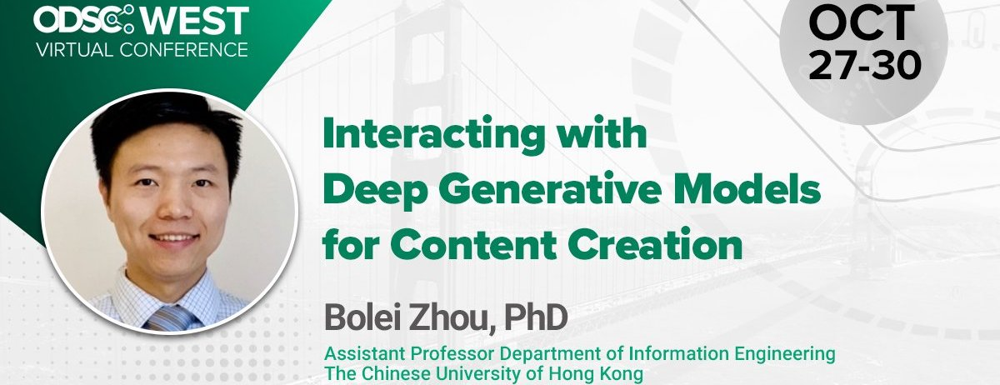

## Tutorial on Generative Modeling

Deep generative models have made great progress to synthesize data realistically in various domains such as image generation and speech synthesis. Generative modeling brings a new paradigm shift in AI from content classification and regression to content analysis and creation. 

This tutorial aims at introducing the basics of deep generative models such as Variational AutoEncoder (VAEs) and Generative Adversarial Networks (GANs) as well as the user interaction with the models for content manipulation and creation. By completing this workshop, you will have an understanding of the deep generative models, their strengths and weaknesses, and their promising applications in content analytics and creation. The workshop will focus on the generative models used in image synthesis but the introduced methodology is able to be extended in different domains. 

**Session 1: Introduction of Deep Generative Models** <a href="session1-small.pdf">slide pdf</a> 
The basics of the deep generative models and their modern development.

**Session 2: Content Creation using Deep Generative Models** <a href="session2-small.pdf">slide pdf</a>  
What are the internal representations of the deep generative models and how to interact with the models for content understanding and creation.

### References

Sample code for VAE: [https://github.com/pytorch/examples/blob/master/vae/main.py
](https://github.com/pytorch/examples/blob/master/vae/main.py
)

Sample code for GAN: [https://github.com/pytorch/examples/blob/master/dcgan/main.py
](https://github.com/pytorch/examples/blob/master/dcgan/main.py
)

Colab for running BigGAN pretrained model: [https://colab.research.google.com/github/tensorflow/hub/blob/master/examples/colab/biggan_generation_with_tf_hub.ipynb 
](https://colab.research.google.com/github/tensorflow/hub/blob/master/examples/colab/biggan_generation_with_tf_hub.ipynb 
)

Colab for running StyleGAN pretrained models: [https://colab.research.google.com/github/genforce/genforce/blob/master/docs/synthesize_demo.ipynb 
](https://colab.research.google.com/github/genforce/genforce/blob/master/docs/synthesize_demo.ipynb 
)

Colab for InterFaceGAN: [https://colab.research.google.com/github/genforce/interfacegan/blob/master/docs/InterFaceGAN.ipynb](https://colab.research.google.com/github/genforce/interfacegan/blob/master/docs/InterFaceGAN.ipynb )

Colab for HiGAN: [https://colab.research.google.com/github/genforce/higan/blob/master/docs/HiGAN_Bedroom.ipynb](https://colab.research.google.com/github/genforce/higan/blob/master/docs/HiGAN_Bedroom.ipynb)

Colab for semantic diffusion: [https://colab.research.google.com/github/genforce/idinvert_pytorch/blob/master/docs/Idinvert.ipynb](https://colab.research.google.com/github/genforce/idinvert_pytorch/blob/master/docs/Idinvert.ipynb)
